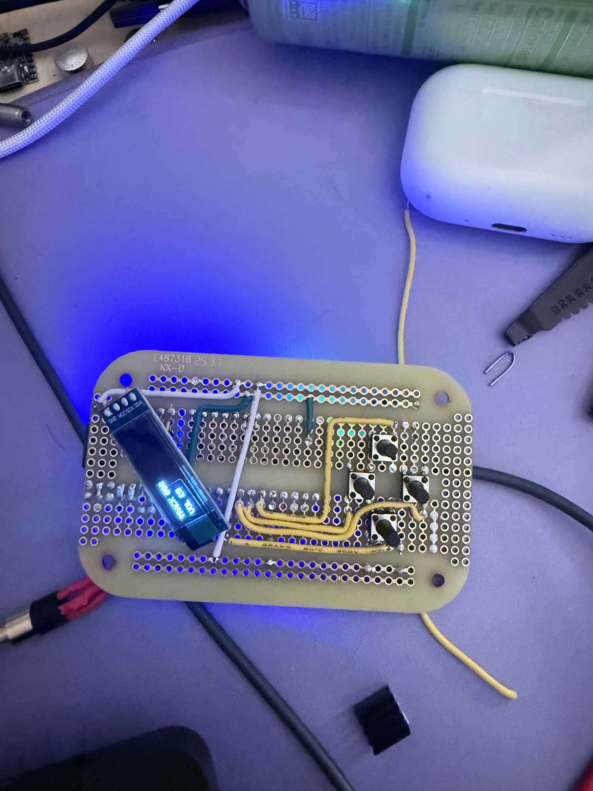
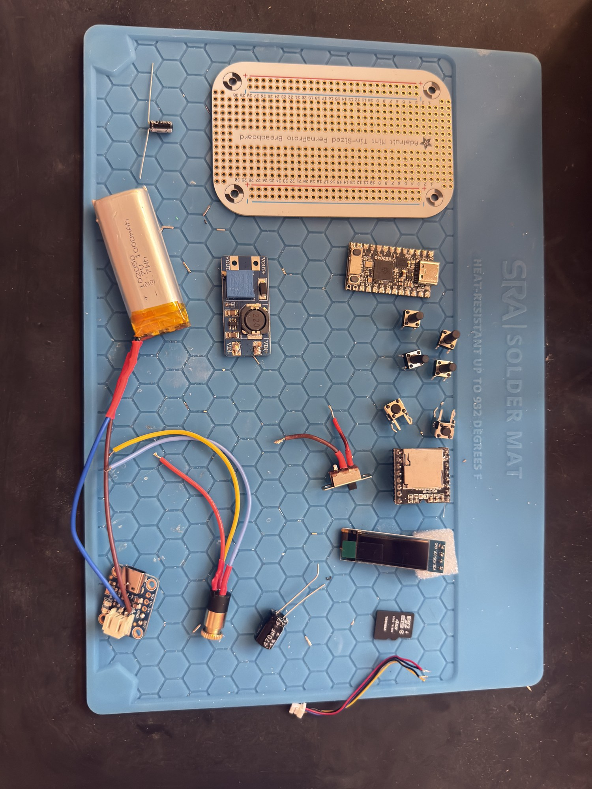
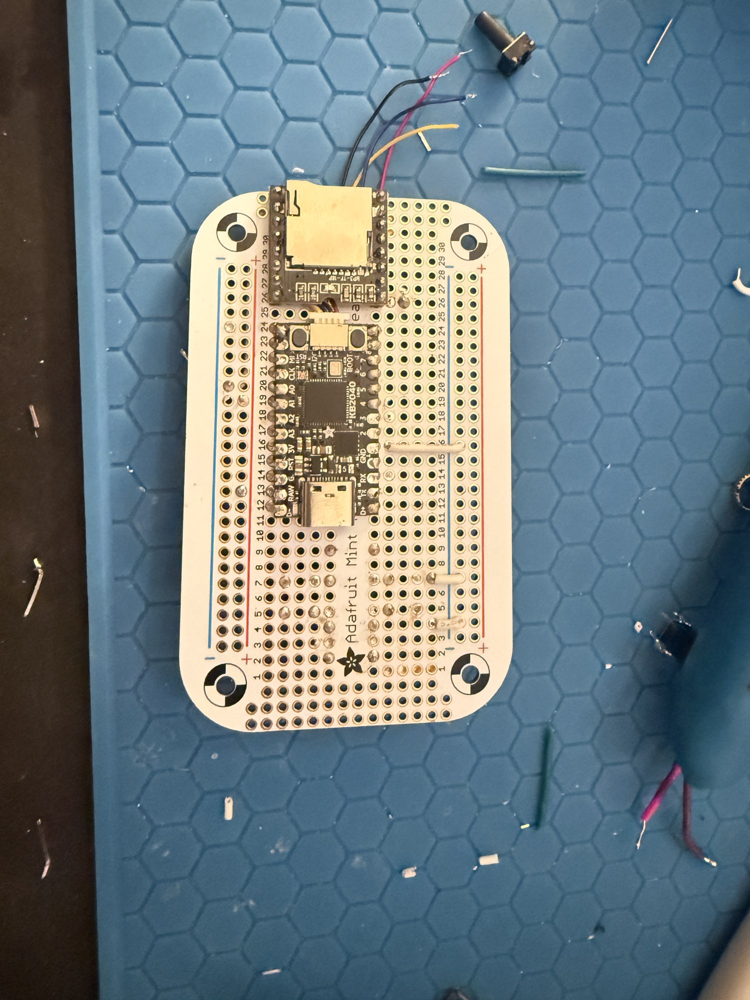
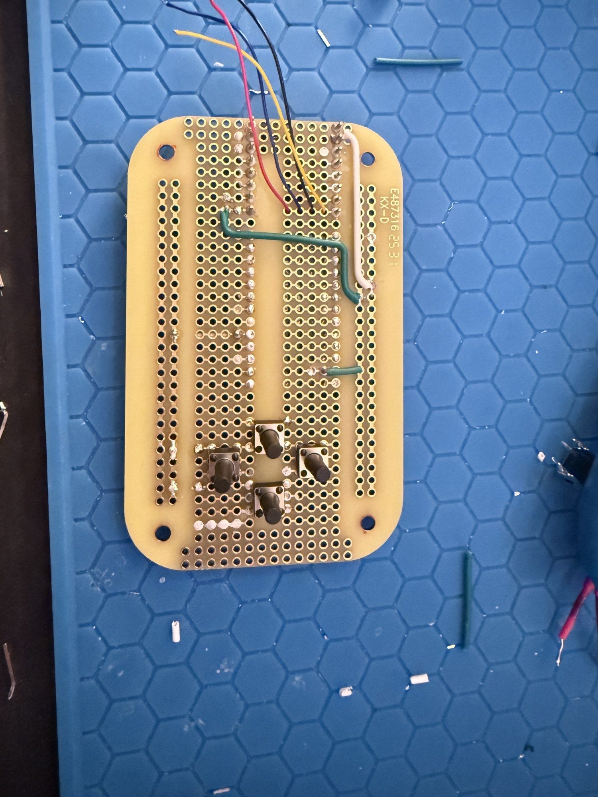
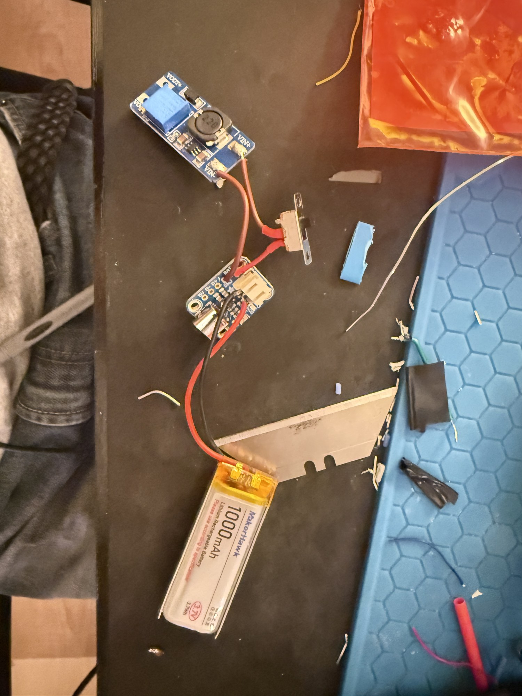

# Revision 1 build gallery

[Back to the project](../README.md) · [Hardware](hardware.md) · [Pinout](pinout.md)

Selected views of the first prototype. Earlier assembly photos show work in progress and may differ from the final wiring. The connection tables record the builder's latest supplied assignments.

## Powered prototype

The display and four directional controls on the hand-wired board. This is the current prototype stage, with no shell yet.

## Parts laid out

Controller, display, playback module, power components, buttons, and the Perma-Proto board before assembly. Some loose components were exploratory; this photo is not a final bill of materials.

## Controller and playback module

A clear view of the KB2040 and DFPlayer Mini mounted on the prototyping board during assembly.

## Underside wiring and controls

The underside shows the soldered connections, wire routing, and four-button layout during the build.

## Battery, charger, and switch

The separate power assembly: rechargeable battery, USB-C charger, on/off switch, and adjustable converter. The converter model remains to be confirmed.

## Photo records

| Repository image | Original photo |
| :--- | :--- |
| `prototype-powered.jpg` | IMG_6475.jpeg |
| `parts-layout.jpg` | IMG_6467.jpeg |
| `controller-and-dfplayer.jpg` | IMG_6473.jpeg |
| `underside-wiring.jpg` | IMG_6474.jpeg |
| `battery-and-power.jpg` | IMG_6478.jpeg |

Photos are from the builder. Repository copies are resized for browsing and exported without camera/location metadata; their contents have not been retouched. The original RAW files and video are not included in this curated gallery.
