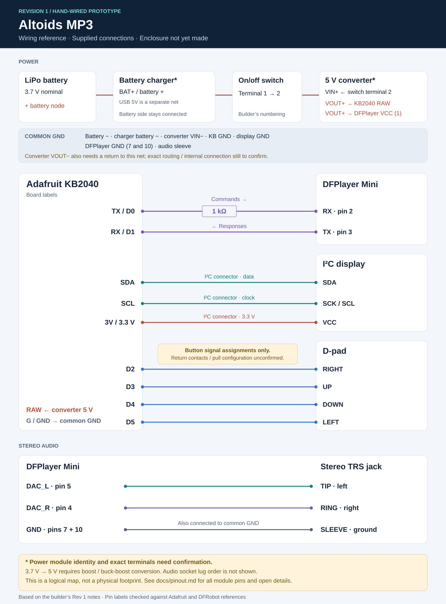

# Revision 1 pinout

[Back to the project](../README.md) · [SVG diagram](diagrams/rev1-wiring.svg) · [Editable CSV](pinout.csv)

This is a connection-by-connection record of the builder's Rev 1 wiring notes. `KB` means **Adafruit KB2040**; `DP` and `DP3` mean **DFPlayer Mini**, as confirmed by the builder. Pin names below refer to the labels on the modules, not to row numbers on the prototyping board.

**Coverage:** all connections supplied by the builder are included. Details not supplied are explicitly marked; this is not yet a fully verified reproduction guide or a manufacturing schematic.



## Power, battery, and switch

| From | To | Connection / note |
| :--- | :--- | :--- |
| Battery `+` | Charger battery `+` | Battery side of the charger, not its USB `5V` input |
| Battery `−` | Charger battery `−` / ground | Battery negative |
| Battery / charger negative node | Common GND and converter `VIN−` | Shared return described in the build notes |
| Battery / charger positive node | On/off switch terminal **1** | Unswitched battery supply |
| On/off switch terminal **2** | Converter `VIN+` | Switched battery supply |
| Converter `VOUT+`, set to **5 V** | DFPlayer `VCC` | DFPlayer power |
| Converter `VOUT+`, set to **5 V** | KB2040 `RAW` | Controller supply, as recorded by the builder |
| KB2040 `G` / `GND` | Common GND | Controller ground |
| DFPlayer **both** `GND` pins | Common GND; audio jack ground joins this net | Both module ground pins are used |
| Converter `VOUT−` | Common GND | Required output return; not separately listed in the original notes. Confirm whether internally common with `VIN−` on the installed module. |

The switch terminal numbers **1** and **2** are the builder's labels. They are not a universal switch pinout. If the switch has three lugs, identify the connected pair with a continuity test; the third lug's use was not specified.

The original notes call the converter a “buck converter.” A nominal **3.7 V single-cell battery feeding a 5 V rail needs a boost (step-up) or buck-boost converter**. A buck-only converter cannot raise that voltage. The exact converter model has not been confirmed, so this documentation uses the neutral name **5 V DC-DC converter**. Measure its output before connecting the modules.

The charger in the photos resembles an Adafruit USB-C Micro-Lipo board, but its exact model is unconfirmed. For that board, `BAT` is the battery node and `5V` is USB power; these are different nets. Reference: [Adafruit charger pinout](https://learn.adafruit.com/adafruit-microlipo-and-minilipo-battery-chargers/pinouts).

The KB2040's `RAW` rail and its USB-to-RAW jumper affect USB power routing. Document the installed jumper state and check both boards' power paths before powering the converter and KB2040 USB simultaneously. Reference: [Adafruit KB2040 power and pin labels](https://learn.adafruit.com/adafruit-kb2040/pinouts).

## KB2040 assignments

| KB2040 label | Connection | Purpose |
| :--- | :--- | :--- |
| `TX` / `D0` | **1 kΩ series resistor** → DFPlayer `RX` | Serial commands to the player |
| `RX` / `D1` | DFPlayer `TX` | Serial responses from the player |
| `D2` | D-pad **right** signal contact | Button input |
| `D3` | D-pad **up** signal contact | Button input |
| `D4` | D-pad **down** signal contact | Button input |
| `D5` | D-pad **left** signal contact | Button input |
| `SDA` | Display `SDA` | I²C data, through the I²C connector |
| `SCL` | Display `SCK` / `SCL` | I²C clock, through the I²C connector |
| `3V` / 3.3 V | Display `VCC` | Display power |
| `G` / `GND` | Display `GND` and common GND | Shared reference |
| `RAW` | Converter 5 V output | Controller supply |

The other exposed KB2040 pins (`D6`–`D10`, `A0`–`A3`, SPI `CLK`/`MI`/`MO`, `RST`, and USB `D+`/`D−`) have **no project connection specified** in the supplied notes. The onboard BOOT, reset, and NeoPixel functions are not external D-pad assignments.

Board-label reference: [Adafruit KB2040 pinouts](https://learn.adafruit.com/adafruit-kb2040/pinouts). These names identify connections; the project's firmware language and pin declarations have not yet been provided.

## DFPlayer Mini: all 16 module pins

The numbers follow the [DFRobot DFPlayer Mini manual, pin-description table](https://image.dfrobot.com/image/data/DFR0299/DFPlayer%20Mini%20Manul.pdf). Check the orientation against that reference and the labels on your exact module; the diagram here is a logical connection map, not a footprint.

| Pin | DFPlayer label | Rev 1 connection |
| :--- | :--- | :--- |
| 1 | `VCC` | Converter 5 V output |
| 2 | `RX` | KB2040 `TX` through **1 kΩ** |
| 3 | `TX` | KB2040 `RX` |
| 4 | `DAC_R` | Audio jack right channel |
| 5 | `DAC_L` | Audio jack left channel |
| 6 | `SPK2` | No connection specified |
| 7 | `GND` | Common GND |
| 8 | `SPK1` | No connection specified |
| 9 | `IO1` | No connection specified |
| 10 | `GND` | Common GND |
| 11 | `IO2` | No connection specified |
| 12 | `ADKEY1` | No connection specified |
| 13 | `ADKEY2` | No connection specified |
| 14 | `USB+` | No connection specified |
| 15 | `USB−` | No connection specified |
| 16 | `BUSY` | No connection specified |

TX and RX cross between the boards. The resistor is in series on **KB2040 TX → DFPlayer RX**. DFRobot also documents this resistor in its [DFPlayer reference](https://wiki.dfrobot.com/dfr0299/docs/20905).

## I²C display

| KB2040 I²C connection | Display connection |
| :--- | :--- |
| `GND` | `GND` |
| 3.3 V (`3V`) | `VCC` |
| `SDA` | `SDA` |
| `SCL` | `SCK` (the clock label visible in the photos) |

The display is connected through the KB2040's I²C connector. The screen's `SCK` label means the clock connection in this documented I²C setup; it does not mean the screen is wired to the separate KB2040 SPI clock pin. Match signal labels instead of assuming a left-to-right connector order or cable color. Display controller, resolution, and I²C address remain unconfirmed.

## D-pad

```text
                 UP
                 D3

       LEFT              RIGHT
        D5                 D2

                DOWN
                 D4
```

These are physical directions only. Play/pause, track navigation, volume actions, and short/long press behavior are defined by the existing firmware and have not been documented yet.

**Still to confirm:** where the other contact of each button connects, and the pull-up or pull-down configuration. The original notes only specify the signal pins. If the buttons connect to common GND, they can be read as active-low inputs with suitable pull-ups; that is conditional guidance, not confirmation of the installed wiring. A four-leg tactile switch has internally paired contacts, so check the switched pair with a continuity test.

## Stereo audio jack

| DFPlayer | Audio connection | Standard three-contact TRS naming |
| :--- | :--- | :--- |
| `DAC_L` | Left channel | **Tip** |
| `DAC_R` | Right channel | **Ring** |
| Both `GND` pins / common GND | Audio return | **Sleeve** |

The builder's “aux L ring” has been normalized to **left / tip** for a standard stereo TRS connector. Right is ring, and ground is sleeve. Reference: [Extron stereo connector wiring](https://mediadev.extron.com/public/download/files/userman/68-1052-01_1up.pdf).

This defines the plug contacts, not the physical solder-lug positions on an unidentified socket. Confirm the socket lugs with a plugged-in TRS cable and a continuity test. `SPK1` and `SPK2` are not used for this documented stereo DAC connection.

## Details still to confirm

- D-pad return contacts and input pull configuration.
- Exact converter model, its output voltage, and how `VOUT−` returns to common GND.
- Exact charger model, battery specification, charging current, and battery protection / low-voltage cutoff arrangement.
- Charger behavior with the player running; charging during playback has not been characterized here.
- KB2040 USB-to-RAW jumper state and simultaneous USB/external-power behavior.
- Display controller, resolution, address, and firmware driver.
- Audio socket lug mapping and any fitted output coupling components.
- Locations and values of any capacitors: loose capacitors appear in the parts photo, but their installed connections were not supplied.

The wiring reference has been checked against the supplied notes and manufacturer pin labels. No electrical measurements or firmware tests have been performed as part of this documentation.
